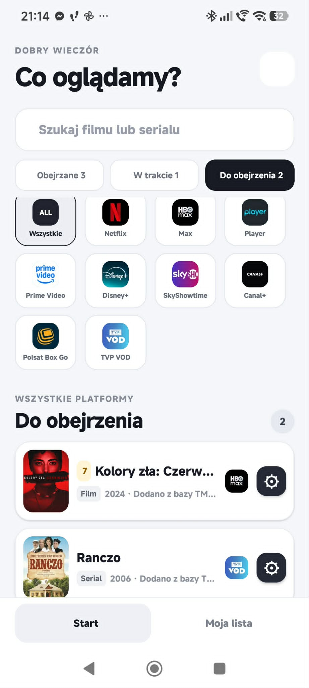
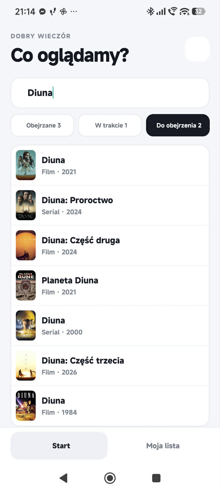
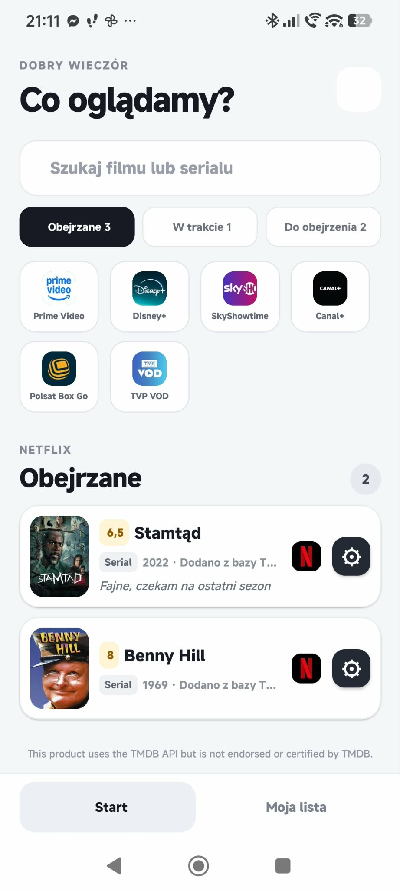
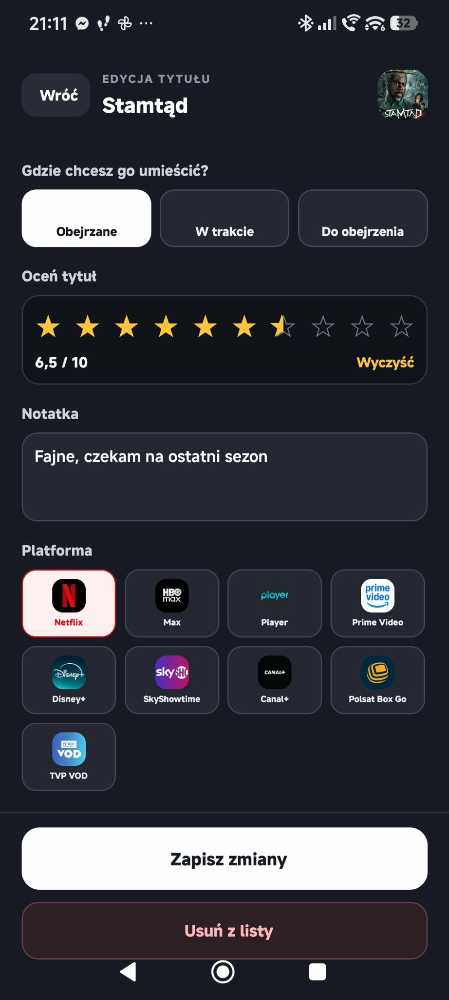

# Seansownik

Mobilna aplikacja na Androida do prowadzenia prywatnej listy filmów i seriali. Łączy wyszukiwanie w TMDB z lokalnym zapisem statusu oglądania, platformy, oceny i własnej notatki.

**[Zobacz stronę projektu](https://pendulumpl.github.io/seansownik-portfolio/)** · [Polityka prywatności](https://pendulumpl.github.io/seansownik-portfolio/privacy.html)

> Działające MVP · 13 testów automatycznych · CI w GitHub Actions · produkcyjny pakiet Android App Bundle

## Problem i rozwiązanie

Projekt powstał z rzeczywistej potrzeby prowadzenia wspólnej, czytelnej listy tytułów. Zamiast rozbudowanego systemu kont aplikacja działa w modelu **local-first**: nie wymaga rejestracji, a lista i notatki pozostają na telefonie.

Użytkownik może znaleźć film lub serial w TMDB, przypisać go do jednej z trzech list, wybrać platformę, wystawić ocenę i dodać notatkę. Kopię danych można wyeksportować do pliku JSON i później bezpiecznie przywrócić.

## Ekrany działającej aplikacji

| Biblioteka i lista do obejrzenia | Wyszukiwanie w TMDB |
|:---:|:---:|
|  |  |
| **Filtrowanie według platformy** | **Ocena i prywatna notatka** |
|  |  |

## Najważniejsze funkcje

- wyszukiwanie filmów i seriali przez TMDB API,
- listy „Obejrzane”, „W trakcie” i „Do obejrzenia”,
- filtrowanie według platformy streamingowej,
- numerowanie obejrzanych tytułów globalnie i osobno dla każdej platformy,
- oceny od 0,5 do 10 oraz prywatne notatki,
- ręczne dodawanie tytułów i obsługa pozycji bez plakatu,
- wykrywanie duplikatów z możliwością otwarcia istniejącego wpisu,
- cofnięcie przypadkowego usunięcia,
- eksport i walidowany import kopii danych w formacie JSON,
- czytelne stany braku wyników oraz błędów sieci i lokalnego zapisu.

## Moja rola i sposób pracy

Prowadziłem projekt od rozpoznania potrzeby do instalowalnej wersji Android:

- ustalałem zakres i priorytety funkcji,
- projektowałem przebieg głównych scenariuszy użytkownika,
- testowałem kolejne wersje na prawdziwym telefonie,
- zbierałem uwagi testerki i zamieniałem je w poprawki,
- integrowałem TMDB i lokalne przechowywanie danych,
- przygotowałem testy, CI, dokumentację, stronę portfolio i build EAS.

Narzędzia AI wspierały mnie przy implementacji, analizie błędów i refaktoryzacji. Decyzje produktowe, weryfikacja działania oraz odpowiedzialność za końcowy rezultat pozostawały po mojej stronie. Repozytorium pokazuje zarówno działające rozwiązanie, jak i znane ograniczenia — nie przedstawia MVP jako gotowego systemu dla milionów użytkowników.

## Technologie

- React Native 0.81,
- Expo SDK 54 i EAS Build,
- React 19,
- JavaScript,
- AsyncStorage,
- TMDB API,
- Node.js Test Runner,
- GitHub Actions.

## Architektura i decyzje

Aplikacja działa w modelu local-first. AsyncStorage przechowuje bibliotekę na urządzeniu, a TMDB służy wyłącznie do pobierania metadanych podczas wyszukiwania.

Ryzykowna logika została wydzielona z interfejsu do testowalnych modułów:

- **src/tmdb.js** i **src/tmdbMapper.mjs** — zapytania oraz mapowanie odpowiedzi TMDB,
- **src/storage.js** — lokalny odczyt i zapis,
- **src/backup.mjs** — walidacja importowanej kopii,
- **src/duplicates.mjs** — wykrywanie powtórzonych pozycji,
- **src/watchedOrder.mjs** — kolejność i numerowanie obejrzanych tytułów.

Więcej informacji zawiera [dokumentacja architektury](docs/architecture.md).

## Kontrola jakości

- 13 testów logiki mapowania TMDB, importu kopii, numerowania i duplikatów,
- GitHub Actions uruchamia instalację, testy oraz eksport Android dla pull requestów,
- wcześniejsze zapytanie wyszukiwania jest anulowane po zmianie frazy,
- błędy sieci i lokalnego zapisu są pokazywane użytkownikowi,
- uszkodzona kopia nie zastępuje istniejącej biblioteki,
- repozytorium nie zawiera tokenu TMDB, danych użytkowników ani klucza podpisującego Android.

## Uruchomienie lokalne

Wymagane są Node.js oraz bezpłatny token TMDB Read Access.

~~~bash
npm install
copy .env.example .env
npm run start
~~~

W pliku .env ustaw:

~~~env
EXPO_PUBLIC_TMDB_TOKEN=twoj_token_tmdb
~~~

Plik .env jest ignorowany przez Git. Wartość EXPO_PUBLIC_* trafia do aplikacji klienckiej, dlatego nie należy traktować jej jak sekretu produkcyjnego. Rozwiązanie wymagające ukrycia poświadczeń potrzebowałoby własnego backendu.

### Polecenia

~~~bash
npm run start
npm run android
npm run ios
npm test
~~~

## Świadome ograniczenia i dalszy rozwój

- główny ekran nadal jest zbyt dużym komponentem,
- projekt korzysta z JavaScript zamiast TypeScript,
- testy obejmują logikę, ale jeszcze nie interfejs,
- dane nie synchronizują się automatycznie między urządzeniami,
- ręczna kopia JSON zastępuje obecnie automatyczny backup.

Najbliższy techniczny krok to podział App.js na mniejsze komponenty i hooki, a następnie migracja do TypeScript oraz dodanie testów komponentów.

## Autor

**Paweł Karolak** · [LinkedIn](https://www.linkedin.com/in/pawel-karolak-lodz/) · [GitHub: PendulumPL](https://github.com/PendulumPL)

Kontakt: [przywrocwspomnienia@gmail.com](mailto:przywrocwspomnienia@gmail.com)
